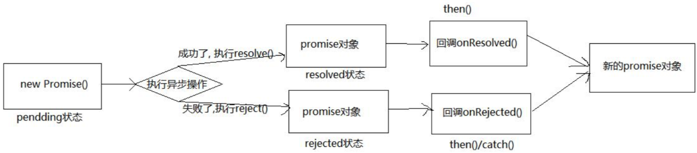

# 理解

* 抽象表达：Promise是js中进行异步编程的新的解决方案（旧的是谁？）
  * 多个异步串行问题，链式调用（依然还是基于回调的）
  * 多个异步并发问题，同时拿到多个异步的执行结果 Promise.all
* 具体表达：
  * 从语法层面：Promise是一个构造函数
  * 从功能层面：Promise实例用来封装一个异步操作并可以获取其结果

# promise的状态
promise共有三种状态：
* pending 初始态、未知态
* fulfilled 成功态、解决态
* rejected 失败态、拒绝态

状态的变化：
* pending -> fulfilled
* pending -> rejected

说明: 只有这2种变化, 且一个 promise 对象的状态只能改变一次
无论变为成功还是失败, 都会有一个结果数据 成功的结果数据一般称为 vlaue, 失败的结果数据一般称为reason

# promise的基本流程


# promise的基本使用
```js
// 创建Promise实例promise
const promise = new Promise((resolve, reject) => {
  // 执行异步操作
  setTimeout(() => {
    const time = Date.now() // 如果当前时间是奇数代表成功，偶数代表失败
    
    if (time % 2 === 1) {
      // 如果成功了，调用resolve(value)
      resolve('成功的数据' + time)
    } else {
      // 如果失败了，调用reject(reason)
      reject('失败的数据' + time)
    }
  }, 1000)
})

// 通过promise的then()指定成功和失败的回调函数
promise.then(value => {
  console.log('成功的回调, value:', value)
}, reason => {
  console.log('失败的回调, reason:', reason)
})
```